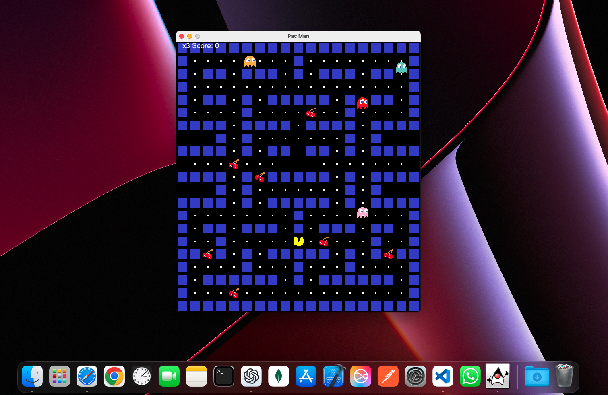
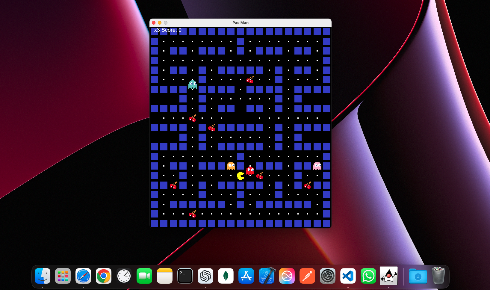
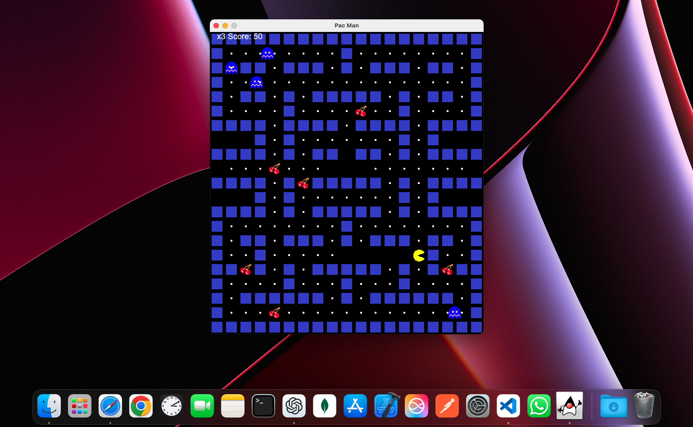

# PacMan Game

This is a simple implementation of the classic PacMan game using Java and Swing. The game features PacMan, ghosts, walls, food, and cherries.

## Features

- **PacMan Movement**: PacMan can move up, down, left, and right using the arrow keys.
- **Ghosts**: Four types of ghosts (blue, orange, pink, red) that move randomly and can become vulnerable.
- **Walls**: Static obstacles that PacMan and ghosts cannot pass through.
- **Food**: Small pellets that PacMan can eat to gain points.
- **Cherries**: Special items that make ghosts vulnerable for a short period.
- **Score and Lives**: The game tracks the player's score and remaining lives.
- **Game Over**: The game ends when PacMan loses all lives.

## Classes and Methods

### `PacMan`

The main class that extends `JPanel` and implements `ActionListener` and `KeyListener`.

- **Constructor**: Initializes the game, loads images, sets up the game loop, and starts the game.
- **loadMap()**: Loads the game map, placing walls, ghosts, food, and cherries.
- **paintComponent(Graphics g)**: Draws the game components on the screen.
- **draw(Graphics g)**: Helper method to draw PacMan, ghosts, walls, food, and cherries.
- **move()**: Updates the positions of PacMan and ghosts, checks for collisions, and handles game logic.
- **collision(Block a, Block b)**: Checks if two blocks collide.
- **resetPositions()**: Resets the positions of PacMan and ghosts.
- **actionPerformed(ActionEvent e)**: Called on each game loop iteration to update the game state and repaint.
- **keyTyped(KeyEvent e)**, **keyPressed(KeyEvent e)**, **keyReleased(KeyEvent e)**: Handle keyboard input for controlling PacMan.

### `Block`

A nested class representing a game object (PacMan, ghost, wall, food, cherry).

- **Constructor**: Initializes the block with an image, position, and size.
- **updateDirection(char direction)**: Updates the direction and velocity of the block.
- **updateVelocity()**: Updates the velocity based on the current direction.
- **reset()**: Resets the block to its starting position.

## How to Play

1. Use the arrow keys to move PacMan.
2. Eat all the food pellets to gain points.
3. Avoid the ghosts unless they are vulnerable (indicated by a different image).
4. Eat cherries to make ghosts vulnerable for a short period.
5. The game ends when PacMan loses all lives.

## Screenshots

### Game Start

### PacMan Eating Food

### Ghosts Vulnerable

Enjoy playing PacMan!

